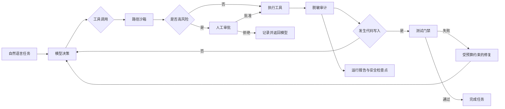

# RepoPilot

> 可审计、可恢复、可评测的软件工程 Agent。

RepoPilot 面向代码仓库维护任务，通过 OpenAI 兼容的 Function Calling 接口完成文件理解、代码修改、测试验证和失败修复。项目重点不是“让模型拥有更多权限”，而是为不确定的 Agent 行为建立可验证的工程边界。

## 核心能力

- **测试驱动自修复**：代码写入后必须运行测试，失败后最多自动修复 3 轮。
- **最小权限控制**：路径沙箱阻止目录越界，写文件和测试执行需要人工审批。
- **循环与成本防护**：限制最大步骤，使用调用及结果指纹阻断无进展循环。
- **可审计与可恢复**：记录脱敏工具轨迹、Git Diff、Token 用量和原子检查点。
- **Agent Evals**：固定 4 类隔离任务，统计通过率、步骤数和 Token，并支持多模型横向比较。
- **可视化工作台**：展示运行质量、模型排名、任务轨迹和安全架构。

## 执行链路



## 快速开始

要求 Python 3.13+ 与 [uv](https://docs.astral.sh/uv/)。

```powershell
uv sync

$env:OPENAI_API_KEY = "你的 API Key"
$env:OPENAI_BASE_URL = "https://api.moonshot.cn/v1"
$env:OPENAI_MODEL_ID = "kimi-k2.6"

uv run repopilot
```

请勿把 API Key 写入源码或提交到 Git。

## 可视化工作台

```powershell
uv run streamlit run .\app.py
```

打开 `http://localhost:8501`，即可查看运行总览、模型对比、任务审计与安全架构。

## 评测与多模型对比

运行固定 Benchmark 会真实调用模型并消耗 API 额度，执行前需要确认：

```powershell
uv run repopilot-benchmark
```

鉴权失败、限流、连接中断和超时会单独标记为基础设施错误，不计入模型通过率，也不会进入排行榜。

切换 `OPENAI_BASE_URL`、`OPENAI_MODEL_ID` 和对应 Key，分别生成不同模型的结果，然后执行：

```powershell
uv run repopilot-compare
```

离线聚合普通运行报告：

```powershell
uv run repopilot-eval
```

## Docker

复制环境变量模板并填入自己的 Key：

```powershell
Copy-Item .env.example .env
docker compose up --build dashboard
```

Dashboard 默认监听 `http://localhost:8501`。交互式运行 Agent：

```powershell
docker compose run --rm agent
```

镜像使用非 root 用户运行，并通过健康检查监控 Dashboard。`.repopilot` 目录挂载到宿主机，用于保存报告、检查点和评测结果。

## 测试

```powershell
uv run python -m pytest -q
```

项目包含覆盖路径沙箱、审批门禁、测试执行、自修复预算、循环阻断、检查点、脱敏审计和评测链路的单元及集成测试。

## 项目结构

```text
repopilot/                  Agent 核心、审计、恢复与评测
evals/benchmark.json        固定隔离评测任务集
tests/                      单元测试与集成测试
.streamlit/                 Dashboard 主题配置
.repopilot/                 本地运行数据（不提交 Git）
Dockerfile                  可复现容器镜像
compose.yaml                Dashboard 与 Agent 服务
```

## 安全说明

RepoPilot 仍是学习与作品集项目。运行前请使用独立测试仓库，检查审批预览，不要向模型提供生产密钥或敏感数据。Docker 提供进程与文件系统隔离，但不能替代生产级沙箱和完整的基础设施安全策略。

## 来源与许可

本项目基于 [Learn-OpenClaw](https://github.com/lasywolf/Learn-OpenClaw) 教程继续开发，原始教程说明保存在 [`docs/UPSTREAM_README.md`](docs/UPSTREAM_README.md)。项目沿用仓库中的 MIT License。
